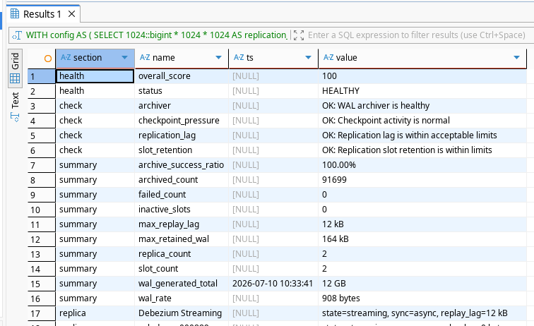

[](https://github.com/VioletSoul/postgres-sql-analytics)
[](https://github.com/VioletSoul/postgres-sql-analytics/commits/main)

# PostgreSQL WAL Analytics & Health Assessment

## Назначение `wal_analytics.sql`

`wal_analytics.sql` — это диагностический SQL-запрос для PostgreSQL 15.x, предназначенный для комплексного анализа подсистемы WAL (Write-Ahead Logging) и оценки эксплуатационного состояния кластера.



Скрипт позволяет быстро определить:

- сколько WAL было сгенерировано с момента последнего сброса статистики
- текущую скорость генерации WAL
- состояние и надежность WAL-архивации
- состояние репликации и задержки standby-серверов
- риски, связанные с удержанием WAL через replication slots
- уровень нагрузки на checkpoint-механизм
- общее состояние здоровья WAL-подсистемы

Запрос не привязан к конкретной схеме или базе данных и анализирует состояние PostgreSQL на уровне экземпляра сервера.

---

# Возможности

Текущая версия предоставляет:

- метрики генерации WAL
- расчет успешности WAL-архивации
- анализ задержек репликации
- мониторинг удержания WAL через replication slots
- анализ давления checkpoint-операций
- настраиваемые warning и critical пороги
- систему проверки с уровнями severity
- расчет общего health score
- автоматические рекомендации для администратора

---

# Источники данных

Отчет использует стандартные системные представления PostgreSQL:

- `pg_stat_wal` — статистика генерации WAL
- `pg_stat_archiver` — состояние WAL-архиватора и успешность архивирования
- `pg_stat_replication` — состояние потоковой репликации и задержки standby
- `pg_replication_slots` — состояние replication slots и удерживаемый WAL
- `pg_stat_bgwriter` — статистика checkpoint-операций

---

# Общая структура запроса

Запрос построен как последовательность CTE (`WITH` выражений), где каждый этап отвечает за отдельную часть анализа WAL-подсистемы.

---

## 1. `config`

Содержит настраиваемые эксплуатационные пороги, используемые системой оценки состояния.

Примеры параметров:

- предупреждающий порог задержки репликации
- критический порог задержки репликации
- предупреждающий объем удерживаемого WAL
- критический объем удерживаемого WAL
- допустимый уровень успешности архивации

Пороговые значения могут изменяться в зависимости от требований конкретной среды.

---

## 2. `wal_stat`

Получает текущий снимок статистики WAL:

- текущее время
- момент последнего сброса статистики (`stats_reset`)
- количество WAL-записей (`wal_records`)
- количество full page images (`wal_fpi`)
- общий объем созданного WAL (`wal_bytes`)
- счетчики давления WAL-буферов
- операции записи и синхронизации WAL

Это накопительные счетчики PostgreSQL, которые ведутся с момента последнего сброса статистики.

---

## 3. `wal_rate`

Рассчитывает скорость генерации WAL:

- время с момента последнего сброса статистики
- среднюю скорость генерации WAL в байтах в секунду (`wal_bytes_per_second`)

Метрика помогает оценить:

- необходимый объем WAL-хранилища
- интенсивность нагрузки
- потенциальный рост каталога `pg_wal`

---

## 4. `wal_archiver`

Анализирует состояние WAL-архивации.

Собираемые показатели:

- количество успешно архивированных сегментов (`archived_count`)
- количество ошибок архивирования (`failed_count`)
- информация о последнем успешном архивировании
- информация о последней ошибке архивирования
- коэффициент успешности архивации

Пример:

Archive success ratio: 100%  
Failed archives: 0

Снижение коэффициента успешности может указывать на:

- ошибки команды архивирования
- проблемы с хранилищем
- проблемы с правами доступа
- недоступность места назначения архива

---

## 5. `checkpoint_stats`

Собирает статистику checkpoint-операций из:

- `pg_stat_bgwriter`

Анализируются:

- timed checkpoints
- requested checkpoints
- время записи checkpoint
- время синхронизации checkpoint
- активность буферов

Скрипт позволяет обнаружить повышенное давление checkpoint-механизма.

---

## 6. `replication`

Анализирует каждый подключенный standby-сервер.

Собираемая информация:

- имя реплики
- адрес клиента
- состояние репликации
- синхронный или асинхронный режим
- replay lag
- write lag
- flush lag

Задержки рассчитываются через разницу WAL LSN.

Это позволяет обнаружить:

- медленные реплики
- проблемы сети
- задержки применения WAL
- проблемы standby-серверов

---

## 7. `replication_slots`

Анализирует использование replication slots.

Собираемые поля:

- имя слота
- тип слота
- активность
- статус WAL
- объем удерживаемого WAL

Большие объемы удерживаемого WAL могут указывать на:

- неактивных потребителей
- проблемы logical replication
- отключенные приложения
- зависшие процессы обработки WAL

---

# Health engine

Диагностический слой оценивает каждую подсистему и назначает уровень состояния:

| Уровень | Значение |
|----------|----------|
| OK | Нормальное состояние |
| INFO | Информационное состояние |
| WARNING | Требует внимания |
| CRITICAL | Требует немедленного расследования |

Проверяются:

- задержки репликации
- состояние WAL-архивации
- удержание WAL replication slots
- давление checkpoint

Пример:
```
Replication lag:
OK

Archiver:
OK

Slot retention:
WARNING
```
---

# Health score

Запрос рассчитывает общий показатель здоровья WAL-подсистемы.

Пример:
```
Score:
100

Status:
HEALTHY
```
Значение автоматически уменьшается при обнаружении проблем:

- WARNING состояния уменьшают итоговую оценку
- CRITICAL состояния применяют более серьезные штрафы

Это позволяет быстро получить общее представление о состоянии PostgreSQL для ручной проверки или мониторинговых систем.

---

# Recommendations

Скрипт генерирует автоматические рекомендации администратора на основе найденных проблем.

Пример:
```
Replication lag requires attention.

Recommendation:
Monitor standby performance and network latency.
```
Другой пример:
```
Replication slot retention detected.

Recommendation:
Review inactive slots and WAL consumers.
```
---

# Финальный результат

Итоговый вывод группируется по колонке `section`.

## `health`

Общее состояние WAL-подсистемы:

- health score
- текущий статус

---

## `check`

Результаты отдельных диагностических проверок:

- имя проверки
- уровень severity
- описание состояния

---

## `recommendation`

Автоматически сформированные рекомендации по действиям администратора.

---

## `summary`

Общий обзор WAL-подсистемы:

- общий объем созданного WAL
- скорость генерации WAL
- статистика архивирования
- коэффициент успешной архивации
- количество реплик
- максимальные задержки репликации
- статистика replication slots
- максимальный объем удерживаемого WAL

---

## `replica`

Одна строка на каждый standby:

- имя приложения
- состояние репликации
- режим синхронизации
- replay lag

---

## `slot`

Одна строка на каждый replication slot:

- имя слота
- активность
- объем удерживаемого WAL

---

# Типичные сценарии использования

- Быстрая проверка здоровья WAL во время инцидентов
- Проверка состояния после обновления PostgreSQL
- Диагностика проблем репликации
- Контроль роста WAL
- Поиск ошибок архивирования
- Поиск рисков, связанных с replication slots
- Использование в качестве источника данных для мониторинговых панелей

Единая структура вывода позволяет легко разделить данные на отдельные панели мониторинга.

---

# Как читать ключевые поля

## Генерация WAL

`wal_generated_total`

Общий объем WAL, созданный с момента последнего сброса статистики.

---

## Скорость WAL

`wal_bytes_per_second`

Средняя скорость генерации WAL.

Используется для:

- планирования ресурсов
- оценки роста WAL-хранилища

---

## Репликация

`max_replay_lag`

Максимальная задержка применения WAL среди всех реплик.

Рост значения может указывать на:

- нехватку ресурсов standby
- сетевые проблемы
- узкие места репликации

---

## Replication slots

`max_retained_wal`

Максимальный объем WAL, удерживаемый replication slot.

Большие значения требуют проверки:

- состояния слотов
- потребителей WAL
- процессов репликации

---

## Архивация

`archive_success_ratio`

Процент успешно выполненных операций архивирования WAL.

Снижение показателя указывает на проблемы подсистемы архивации.

---

# Совместимость

Проверено на:

PostgreSQL 15.5

Запрос использует только встроенные статистические представления PostgreSQL и не требует установки дополнительных расширений.